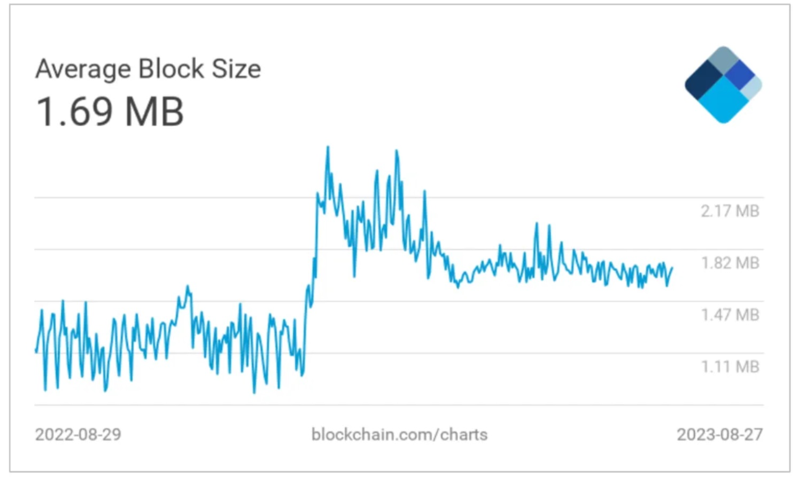

Bitcoin ― the pioneer of blockchain technology has captured the world’s attention with its decentralized and immutable nature.

Yet, as its popularity grows, so does the need for scalability.

The mantra of “bigger blocks” has been thought as a popular solution to Bitcoin’s scalability challenges. Enlarging block size has been a hot debate for years.

## What is Block Size?

Block size refers to the maximum amount of data that can be stored in one block on a blockchain. Bitcoin’s block size is defined in the Bitcoin protocol. Each block in the blockchain contains a set of transactions and other metadata.

Different blockchains have different block size limits, which are typically defined by the consensus rules of the network.

## Block Size Debate

Block size is a key factor in determining the scalability of a blockchain. Some people believe that block size should be increased to accommodate more transaction data.

Others believe that the block size should be kept small to maintain decentralization and security, as Satoshi Nakamoto originally intended.

## Block Size Evolution in Bitcoin
### 1 – Early Days

The block size limit was set to 1 MB by Satoshi Nakamoto in 2010. This was sufficient for the amount of traffic that the network was handling at that time.

The original block size of 1 MB isn’t very big amount of data. It is about the same amount of data as the original Pokémon Red game cartridge released in 1996.

When I think about block size, I am reminded of Game Boy cartridges along with my childhood memories… yes, I’m a millennial. 🎮

Photo by Mika Baumeister on Unsplash

### 2 – Debate
As the network grew in popularity, the block size limit became a bottleneck. There weren’t enough transactions that could be processed per block to meet the demand.

In 2017, a proposal was made to increase the block size to 2 MB. This proposal was controversial and ultimately rejected by the Bitcoin community.

Since the community was unable to agree on the change, the result was a ‘hard fork,’ where two versions of Bitcoin diverged.

The version that included the block size upgrade was eventually given the name Bitcoin Cash (BCH). The unchanged version retained the name Bitcoin (BTC). BCH has a block size limit of 8 MB, which allows it to process more transactions per block than Bitcoin.

### 3 – Current Average Block Size
As of the end of August 2023, the average block size for Bitcoin is approximately 1.7 MB. [1]

The average block size over past 24 hours From https://www.blockchain.com/explorer/charts/avg-block-size

The average block size over past 24 hours. From https://www.blockchain.com/explorer/charts/avg-block-size
The block size limit for Bitcoin is still technically 1 MB, but an upgrade called “Segregated Witness” (SegWit) allows for larger block sizes.

### 4 — Larger Blocks After Bitcoin NFTs
The average block size of Bitcoin has reached all-time highs above 2.5 MB in February 2023, after the introduction of Ordinals, known as Bitcoin-based nonfungible tokens. [2]

Ordinals are a type of Bitcoin NFT that allows each satoshi (the smallest unit of Bitcoin) to be assigned a unique identifier. This makes it possible to track and trace individual satoshis to create NFTs.

The introduction of Ordinals caused an increase in the number of transactions being processed on the Bitcoin network. This has put pressure on the network and increased the average block size.

Overall, the increase in average block size is a sign of the growing popularity and adoption of Bitcoin worldwide. Monitoring the impact of the trend on the Bitcoin network will ensure that it remains accessible for users.

## Bigger Block Misconception
1. Decentralization Under Threat — At the core of Bitcoin’s philosophy lies its decentralization. A larger block means more storage requirement, making it harder for individual participants to run full nodes. Unintentionally, this trend lead to centralization. It potentially undermines the network’s security and resilience.

2. Network Latency — Bigger blocks necessitate the transmission of more data across the network, leading to elevated network latency. This results in longer confirmation times for transactions and a less seamless user experience.

2. Minor’s Dilemma — The incentive structure for miners can be affected by larger blocks. While miners earn transaction fees for transactions, excessively large blocks may dissuade miners from participating. The time and resources needed to validate and propagate blocks can outweigh the potential rewards. It potentially leads to a reduction in miner involvement and security vulnerabilities.

## Solutions Beyond Size
Finally, here’s the exciting part. The Bitcoin community is definitely a hive of innovation. While bigger blocks tend to grab our spotlight, developers have been exploring alternative scalability solutions beyond enlarging block sizes.

I intoduce two notable approaches are Segregated Witness (SegWit) and the concept of Layer 2 solutions:

Segregated Witness (SegWit) – Like a smart rearrangement of furniture in a room. It doesn’t make the room bigger, but it makes it more spacious. Implemented in 2017, SegWit doesn’t increase the block size but optimizes transaction data, allowing more transactions to fit within each block. Bitcoin’s block size limit was increased to 4 million weight units (WU) with the introduction of SegWit. SegWit boosts the network’s capacity while maintaining decentralization. SegWit is a soft fork of the Bitcoin blockchain which does not create a new blockchain.

Layer 2 Solutions – Like taking a shortcut to avoid traffic on the main road. For instance, Lightning Network facilitates rapid and cost-effective microtransactions by establishing payment channels outside the main chain, making it possible to make quick and inexpensive payments, even for small amounts. This approach makes Bitcoin “lightning-fast” without compromising its core principles.
In a Nutshell

Now you’ve got a basic idea of what the blocksize means.

While the concept of bigger blocks might sound like a magic wand for solving Bitcoin’s scalability, the reality is a bit more complicated. Decentralization, speed, and security are all pieces of complex blockchain puzzle.

Yet, the beauty of Bitcoin community is they are constantly coming up with innovative ways to utilize Bitcoin network.
